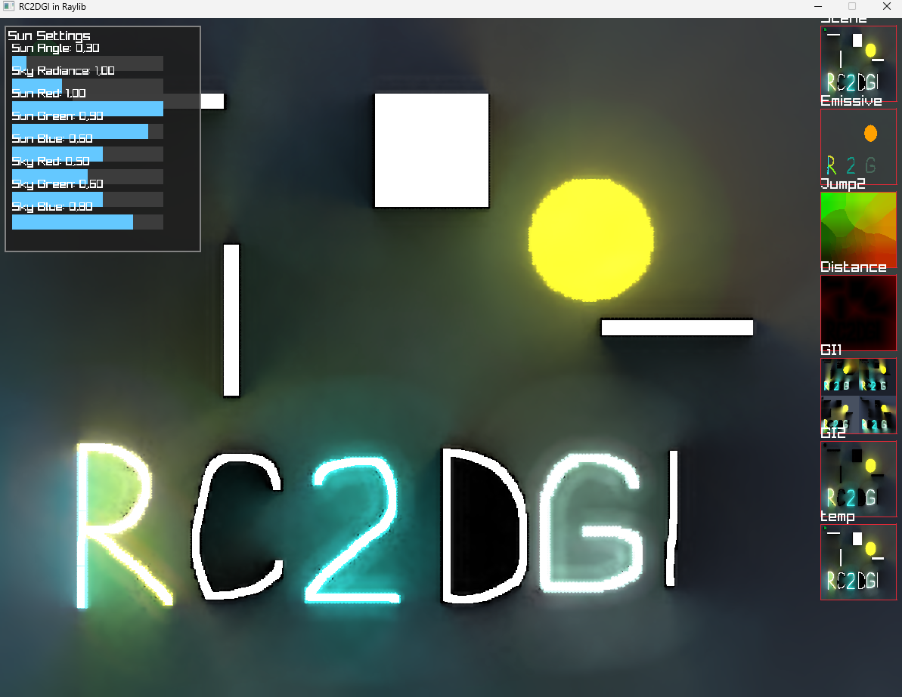

# Raylib Implementation of Radiance Cascades 2‑D Global Illumination  
**RC2DGI – a C#/Raylib port of Youssef Afella’s Unity 2‑D GI system**

> **⚠️ This project is a direct port of the Unity version**  
> <https://github.com/Youssef-Afella/UnityURP-RadianceCascades2DGI>  
> It reproduces the same shader‑based pipeline in a Raylib/C# environment.  
> The code is a fairly straight translation, but the README below explains *every* detail, from the rendering pipeline to the interactive controls.

> **Screenshots and Videos**  
> 
> 
> 

---

## Table of Contents
1. [Overview](#overview)
2. [Features](#features)
3. [Architecture & Pipeline](#architecture--pipeline)
4. [Shaders & Uniforms](#shaders--uniforms)
5. [Controls & UI](#controls--ui)
6. [Building & Running](#building--running)
7. [Extending & Tweaking](#extending--tweaking)
8. [Known Issues & Limitations](#known-issues--limitations)
9. [Acknowledgements](#acknowledgements)
10. [License](#license)

---

## 1. Overview

Radiance Cascades 2‑D Global Illumination (RC2DGI) is a **real‑time** light‑transport solution for 2‑D games.  
The technique uses a **screen‑space distance field** of all occluders and then propagates light in a series of *cascade levels* using ray‑marching against that field.

In this project, the algorithm is executed in **five stages**:

| Stage | Purpose | Render Target |
|-------|---------|---------------|
| 1. **Screen‑UV** | Copies the scene color and emits a “seed” texture where occluders exist. | `jumpRT1` / `jumpRT2` |
| 2. **Jump Flood** | Builds the Voronoi diagram (nearest‑seed lookup) in logarithmic iterations. | `jumpRT1` / `jumpRT2` |
| 3. **Distance Field** | Turns the Voronoi diagram into a per‑pixel distance field. | `distRT` |
| 4. **Radiance Cascades** | Renders light by ray‑marching against the distance field for each cascade level. | `giRT1` / `giRT2` |
| 5. **Merge** | Blends the GI result back onto the scene color. | `tempRT` → `colorRT` |

The entire pipeline runs on the GPU using **GLSL 330** shaders, making it highly scalable and suitable for desktop & mobile GPUs that support OpenGL 3.3+.

---

## 2. Features

| Feature | Description |
|---------|-------------|
| **Real‑time 2‑D GI** | Full global illumination with soft shadows and indirect lighting. |
| **Jump Flood Algorithm** | Fast Voronoi diagram construction (O(log N)). |
| **Distance Field Generation** | Efficient per‑pixel distance to nearest occluder. |
| **Cascade Levels** | Multi‑resolution cascades allow light to propagate over long distances with fewer samples. |
| **Dynamic Scene** | Users can paint walls (occluders) and light emitters on the fly. |
| **Sun & Sky Controls** | GUI to tweak sun angle, colors, and sky radiance. |
| **Debug Views** | 8 side‑by‑side debug textures for each pipeline step. |
| **Customizable** | Change `cascadeCount`, `rayRange`, etc. in code. |
| **Cross‑Platform** | Works on Windows, Linux & macOS (OpenGL 3.3+). |
| **Light Color Cycling** | Left‑click changes the emitter color for creative lighting setups. |

---

## 3. Architecture & Pipeline

Below is a **step‑by‑step** walk‑through of how the main loop runs.

### 3.1. Scene Rendering
```csharp
RenderScene(walls);
HandlePainting();
RedrawSceneToRTs();
```
* `RenderScene`: Draws static walls (white) and a moving sprite to `colorRT`.  
* `HandlePainting`: Uses mouse input to paint walls (right click) and lights (left click).  
* `RedrawSceneToRTs`: Copies the updated wall positions into `colorRT` and the light emitters into `emissiveRT`.  

### 3.2. RC2DGI Pipeline (`DoRC2DGI()`)

1. **Screen‑UV Pass**  
   * Input: `colorRT` (scene color).  
   * Shader: **`ScreenUV.fs`** writes the pixel’s UV coordinates to the **R** and **G** channels *only* where an occluder exists.  
   * Output: `jumpRT1` (or `jumpRT2` depending on ping‑pong).  

2. **Jump Flood Algorithm**  
   * Repeatedly blur the seed texture to propagate the nearest seed’s UV.  
   * Uses two ping‑pong textures (`jumpRT1` ↔ `jumpRT2`).  
   * `steps = ceil(log₂(max(width, height)))`.  
   * Shader: **`JumpFlood.fs`** with `_StepSize` and `_Aspect`.  

3. **Distance Field Pass**  
   * Convert Voronoi UVs into Euclidean distance values.  
   * Shader: **`DistanceField.fs`**.  
   * Output: `distRT`.  

4. **Radiance Cascades**  
   * Loop over each cascade level (high → low).  
   * For each level, read the *previous* cascade texture, ray‑march over the distance field, gather emissive color, accumulate radiance, and write to the *next* cascade texture.  
   * Shaders: **`RadianceCascades.fs`**.  
   * Cascades use **bilinear filtering**; final result is the last cascade.  

5. **Merge Pass**  
   * Blend the GI result with the original scene color.  
   * Shader: **`Merge.fs`** (adds GI to the RGB).  
   * Output: `tempRT` → `colorRT`.  

6. **Debug & GUI**  
   * The main window shows the final `colorRT` texture.  
   * On the right side, thumbnails display `colorRT`, `emissiveRT`, `jumpRT2`, `distRT`, `giRT1`, `giRT2`, and `tempRT`.  
   * A small GUI panel lets you tweak sun & sky parameters.

The entire pipeline runs at **60 fps** on a 1200 × 900 window with a **cascadeCount = 6** on a mid‑range GPU (e.g., NVIDIA GTX 1660). Performance drops linearly with cascadeCount and rayRange.

---

## 4. Shaders & Uniforms

Below are the main GLSL shaders with explanations for each uniform.

| Shader | Purpose | Key Uniforms |
|--------|---------|--------------|
| **ScreenUV.fs** | Writes UV coords for occluders | `_MainTex` (scene) |
| **JumpFlood.fs** | Propagates nearest‑seed UV | `_MainTex` (previous pass), `_StepSize`, `_Aspect` |
| **DistanceField.fs** | Converts UV to distance | `_MainTex` (Voronoi) |
| **RadianceCascades.fs** | Ray‑march GI for one cascade level | ` _ColorTex`, ` _EmissiveTex`, ` _DistanceTex`, ` _Aspect`, ` _CascadeResolution`, ` _CascadeLevel`, ` _CascadeCount`, ` _RayRange`, ` _SkyRadiance`, ` _SkyColor`, ` _SunColor`, ` _SunAngle` |
| **Merge.fs** | Adds GI to base scene | `_MainTex` (scene), `_GITex` (GI) |

### 4.1. RadianceCascades Highlights

* **Cascade Grid** – The screen is split into a grid of *blocks* whose size depends on `_CascadeLevel`.  
* **Ray Direction** – Four rays per block are emitted in evenly spaced angles (360° / (blockSize² * 4)).  
* **Ray March** – For each sample `t`, we fetch the distance field.  
  * If `distance < 0.001`, we hit a surface.  
  * If that surface is emissive, we treat the emission as the radiance; otherwise we use the surface color.  
  * If we exceed the range or go off screen, the ray returns zero.  
* **Cascade Merging** –  
  * For intermediate cascades (`_CascadeLevel < _CascadeCount-1`), the radiance from the lower level is blended with the *upper* cascade via a sampled position.  
  * For the top cascade (`_CascadeLevel == _CascadeCount-1`), we add the analytic sky radiance computed by `SampleSkyRadiance`.  

The shader uses **32 iterations** per ray (can be tuned). Each cascade level reduces the number of rays quadratically, giving a *logarithmic* time complexity relative to screen size.

---

## 5. Controls & UI

| Key / Mouse | Action | Notes |
|-------------|--------|-------|
| **Right‑Click** | Add wall (occluder) at cursor. | The wall is a 10 × 10 pixel square. |
| **Left‑Click** (press) | Begin painting light emitter at cursor. | Light color is random initially. |
| **Left‑Click** (hold) | Keep painting emitter; emits light at the cursor. |
| **Left‑Click** (press again) | Change the emitter color to a new random value. |
| **'C' key** | Clear all walls and emitters. |
| **Sun GUI** (top‑left panel) | Adjust sun angle, sky radiance, and RGB values. |
| **Debug Window** (right side) | View intermediate textures; useful for troubleshooting. |

The UI is drawn using Raylib’s `DrawRectangle`, `DrawText`, and simple slider logic (`GuiSlider`). No external GUI library is required.

---

## 6. Building & Running

### 6.1. Prerequisites

| Tool | Minimum |
|------|---------|
| .NET SDK | 6.0+ (recommended 7.0 for best performance) |
| Raylib‑cs | 4.5+ |
| C++ build tools (MSVC / GCC / Clang) | For the native Raylib DLL |
| OpenGL | 3.3+ driver |

### 6.2. Clone & Build

```bash
git clone https://github.com/Hybrid46/RadianceCascade2DGlobalIllumination.git
cd RadianceCascade2DGlobalIllumination

# Restore Raylib‑cs NuGet package
dotnet restore

# Build
dotnet build -c Release
```

The executable will be under `bin/Release/net6.0`.

### 6.3. Run

```bash
dotnet run --project RadianceCascade2DGlobalIllumination.csproj
```

A window titled **“RC2DGI in Raylib”** should open. Press **Right‑Click** to add walls, **Left‑Click** to add lights, and use the Sun panel to tweak lighting. The debug thumbnails appear on the right; close the window to exit.

---

## 7. Extending & Tweaking

| Parameter | Default | Typical Range | Effect |
|-----------|---------|---------------|--------|
| `cascadeCount` | 6 | 4–10 | More cascades → smoother light but higher GPU cost. |
| `rayRange` | 2.0 | 1–4 | Larger range → light can travel farther; may produce artifacts if too high. |
| `renderScale` | 1.0 | 0.5–2.0 | Down‑scale the whole pipeline for performance; may reduce detail. |
| `screenWidth` / `screenHeight` | 1200 × 900 | Any | Window size; note that the cascade resolution is computed from these. |
| `skyRadiance`, `skyColor`, `sunColor`, `sunAngle` | see defaults | Sun direction influences indirect lighting. | Controls overall lighting mood. |

To experiment, change the values in `RC2DGI.cs` or add command‑line arguments (e.g., `--cascadeCount 8`) and rebuild.

---

## 8. Known Issues & Limitations

* **Performance on very low‑end GPUs** – The cascade merging uses texture lookups; older GPUs may stall.
* **No antialiasing** – The entire pipeline mostly uses point filtering. Enabled bilinear filtering on `giRT1`/`giRT2` to soften edges.  
* **UI is basic** – For production use, replace with Dear ImGui or an external library.  
* **Debug view is not scaled** – The thumbnails are fixed at 100 px; resizing the window may misalign them.
* **8 Bit Precision** – Raylib_cs have only R8G8B8A8 textures so I had to use 32 bit floats in 8 bit channels. Maybe try to pack 32bit floats to 16bit halfs. I already have a buggy branch for it!

---

## 9. Acknowledgements

* **Alexander Sannikov** – Radiance Cascades 2D Global Illumination Paper:  
  <https://drive.google.com/file/d/1L6v1_7HY2X-LV3Ofb6oyTIxgEaP4LOI6/view>
* **Youssef Afella** – Original Unity implementation:  
  <https://github.com/Youssef-Afella/UnityURP-RadianceCascades2DGI>
* **Raylib** – Lightweight game framework. 
* **Raylib‑cs** – C# bindings.  
| https://github.com/ChrisDill/Raylib-cs 
* **Shadertoy** – Inspiration for distance field, radiance cascades and analytic direct illumination shaders:  
  * Analytic Direct Illumination: <https://www.shadertoy.com/view/NttSW7>
  * Distance Field Generation: <https://www.shadertoy.com/view/lX3Sz8>
  * Radiance Cascades: <https://www.shadertoy.com/view/mtlBzX>

---

## 10. License

This repository is released under the same license as the original Unity project – **MIT**.  
Feel free to use, modify, and distribute the code in your own projects.  
If you use this repository in a commercial product, consider attributing the original author.

---